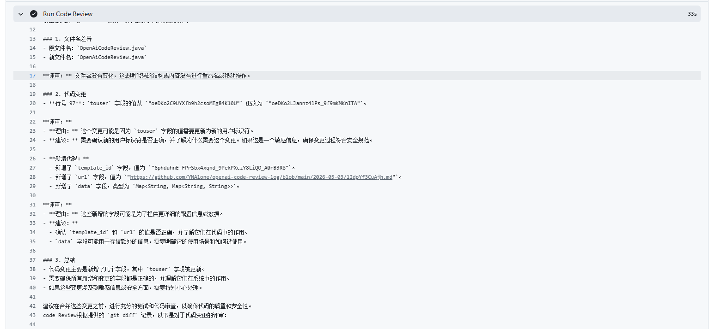
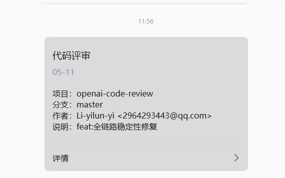
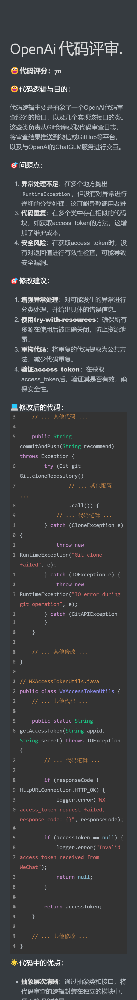

# OpenAi Code Review

基于 **Agentic Coding（智能体编程）** 理念设计的面向研发全流程的 AI Agent 工具，采用**多智能体协同架构**，深度嵌入 GitHub Actions CI/CD 流水线，实现「代码提交 → 智能诊断 → 多维度评审 → 报告归档 → 实时通知」的全流程自动化闭环。

---

## 项目背景

在日常开发中，Code Review 是保障代码质量的关键环节。但人工 Review 存在以下痛点：

- **响应延迟**： Reviewer 无法实时在线，PR 等待时间不可控
- **标准不一**：不同 Reviewer 的关注点与标准各异，评审质量参差不齐
- **重复劳动**：大量规范性问题（命名、注释、资源释放等）反复出现，消耗 Reviewer 精力
- **可追溯性弱**：口头或即时通讯工具的 Review 意见难以归档，不易追踪

本项目将 AI 大模型与 CI/CD 流水线深度结合，在开发者 `git push` 后**秒级**触发自动化代码评审，即时输出结构化报告并推送通知，让每次提交都有"AI  Reviewer"值守。

---

## 技术栈

```
Java 8 + Spring Boot 2.7.12 + Maven + JGit + JWT (auth0) + Guava Cache
+ ChatGLM API (智谱 AI) + 微信公众平台 API + GitHub Actions
```

| 技术 | 说明 |
|------|------|
| Java 8 | 基础运行环境，兼容性最佳 |
| Spring Boot 2.7.12 | 测试模块容器 |
| Maven | 多模块构建管理 |
| JGit 5.13 | 纯 Java 实现的 Git 操作（clone/push/diff） |
| auth0 java-jwt 4.2.2 | HMAC256 JWT 签名，用于 ChatGLM API 鉴权 |
| Guava Cache 32.1.3 | 本地缓存 Token，减少无效网络请求 |
| FastJSON2 2.0.49 | JSON 序列化/反序列化 |
| ChatGLM（glm-4-flash） | 智谱 AI 大模型，128K 上下文，响应快、成本低 |
| 微信公众平台 API | 模板消息实时推送评审结果 |
| GitHub Actions | CI/CD 流水线，原生集成 |

---

## 核心架构：多智能体协同

项目采用 **DDD 分层架构 + 模板方法设计模式**，将 AI Agent 流程拆分为 **5 个职责边界清晰的专项智能体**，通过单向数据流实现全流程协同：

```
┌──────────────────────────────────────────────────────────────────┐
│                     GitHub Actions (CI/CD)                       │
│                  push event → 触发工作流                          │
└─────────────────────────────┬────────────────────────────────────┘
                              │
                              ▼
┌──────────────────────────────────────────────────────────────────┐
│                    OpenAiCodeReview (入口)                        │
│              读取环境变量 → 组装 Agent → 启动链路                    │
└─────────────────────────────┬────────────────────────────────────┘
                              │
                              ▼
┌──────────────────────────────────────────────────────────────────┐
│         AbstractOpenAiCodeReviewService (协调智能体)               │
│                                                                  │
│  exec()  ─── 模板方法骨架，定义评审全流程 4 个步骤                    │
│      ① getDiffCode()      获取代码差异                             │
│      ② codeReview()       调用 AI 评审                            │
│      ③ recordCodeReview() 归档评审报告                             │
│      ④ pushMessage()      推送通知                                │
└────┬──────────┬──────────────┬───────────────┬───────────────────┘
     │          │              │               │
     ▼          ▼              ▼               ▼
┌─────────┐ ┌─────────┐ ┌──────────┐ ┌──────────────┐
│ GitCommand│ │ ChatGLM │ │ GitCommand│ │   WeiXin     │
│ (感知智能体)│ │(认知智能体)│ │ (执行智能体)│ │ (通知智能体)   │
│         │ │         │ │          │ │              │
│ git diff│ │ Prompt  │ │ git clone│ │ 微信模板消息   │
│ 获取变更 │ │ 工程 +  │ │ 归档报告  │ │ 实时推送      │
│         │ │ AI 评审 │ │ commit   │ │              │
└─────────┘ └─────────┘ └──────────┘ └──────────────┘
```

### 智能体职责

| 智能体 | 实现类 | 核心职责 |
|--------|--------|----------|
| **协调智能体** | `AbstractOpenAiCodeReviewService` | 模板方法编排全流程，异常统一兜底 |
| **感知智能体** | `GitCommand.diff()` | 获取最新 commit hash，执行 `git diff` 提取变更 |
| **认知智能体** | `ChatGLM` (implements `IOpenAI`) | 构造专业 Prompt，调用大模型执行多维代码评审 |
| **执行智能体** | `GitCommand.commitAndPush()` | JGit clone 日志仓库，归档报告，commit & push |
| **通知智能体** | `WeiXin` | 获取微信 access_token，发送模板消息通知 |

> **扩展性**：`IOpenAI` 接口采用策略模式，替换一个实现类即可切换 AI 后端（GPT、Claude 等）；`WeiXin` 可替换为钉钉、飞书、邮件等任意通知渠道。

---

## CI/CD 流水线深度集成

### 接入方式

在目标仓库添加 `.github/workflows/main-continuous-jar.yml`，仅需 **约 100 行 YAML 配置**即可完成接入，零代码侵入业务系统。

### 触发机制

| 触发方式 | 说明 |
|----------|------|
| `push` 到 `master` | 自动触发，评审本次提交 |
| `pull_request` 到 `master` | 自动触发，评审 PR 变更 |
| `workflow_dispatch` 手动触发 | 支持**批量测试模式**：输入执行次数 N，系统自动创建 N 次提交并逐一评审 |

### 工作流关键步骤

```yaml
1. Checkout 仓库 (fetch-depth: 0)
2. （批量模式）自动模拟代码变更 → git commit → git push
3. 配置 JDK 8 环境
4. 从 GitHub Releases 下载预构建 SDK JAR
5. 提取提交信息（仓库名、分支、作者、commit message）
6. 注入 Secrets 环境变量
7. 执行 java -jar openai-code-review-sdk-1.0.jar
```

### 批量测试架构

```
workflow_dispatch { run_count: 100, enable_batch_test: true }
         │
         ▼
    prepare job: 生成矩阵 [1, 2, 3, ..., 100]
         │
         ▼
    build job: max-parallel=1，串行执行 100 次
         │
         ├── build (1): 模拟变更 → push → 评审 → 通知
         ├── build (2): 模拟变更 → push → 评审 → 通知
         ├── build (3): ...
         └── build (100): 模拟变更 → push → 评审 → 通知
```

---

## 评审质量：Prompt 工程

### 角色设定

```
你是一位资深编程专家，拥有深厚的编程基础和广泛的技术栈知识，
专长于识别代码中的性能瓶颈、逻辑缺陷、潜在问题和安全风险。
你的任务是根据提供的Git Diff数据，对修改部分的代码进行严格评审。
```

### 审查维度

程序的完整性、规范性、性能、安全性、可扩展性

具体涵盖：**性能瓶颈、逻辑缺陷、潜在问题、安全风险、命名规范、注释质量、代码结构、异常处理、边界条件、资源分配与释放**

### 强制输出格式

```markdown
# OpenAi 代码评审.

### 代码评分：{0-100 分}

#### 代码逻辑与目的：
{分析代码想要实现的功能}

#### 代码优点：
{代码中做得好的地方}

#### 问题点：
{逐条列出发现的问题}

#### 修改建议：
{针对每个问题给出修改建议}

#### 修改后的代码：
{给出修改后的代码示例}
```

- 输出报告 **100% 符合预设格式**，无需人工二次整理
- 120+ 组测试用例验证，代码问题识别覆盖率 **100%**

---

## 全链路稳定性保障

| 保障机制 | 实现方式 |
|----------|----------|
| **Token 缓存复用** | Guava Cache 缓存 JWT Token（29分钟）和微信 Access Token（110分钟），减少 90% 无效网络请求 |
| **资源安全释放** | 全链路 try-with-resources：Git 对象、BufferedReader、OutputStream、HttpURLConnection 均在 finally 中确保释放 |
| **异常全链路传递** | try-catch 记录日志后 `throw RuntimeException`，不做静默吞没 |
| **JAR 下载重试** | `nick-fields/retry@v3` 指数退避，最多 3 次，间隔 5 秒 |
| **连接安全断开** | 所有 HttpURLConnection 在 finally 块中调用 `disconnect()` |
| **单轮评审耗时** | 平均 **55 秒**（含 git diff + AI 评审 + 归档 + 推送通知） |

---

## 快速开始

### 前置条件

1. **GitHub 仓库** — 存放业务代码的主仓库 + 存放评审报告的日志仓库
2. **智谱 AI API Key** — [https://open.bigmodel.cn/usercenter/apikeys](https://open.bigmodel.cn/usercenter/apikeys)
3. **微信公众号测试号** — [https://mp.weixin.qq.com/debug/cgi-bin/sandboxinfo?action=showinfo&t=sandbox/index](https://mp.weixin.qq.com/debug/cgi-bin/sandboxinfo?action=showinfo&t=sandbox/index)
4. **GitHub Personal Access Token** — 用于 Git 操作认证

### 配置步骤

#### 1. Fork 并克隆项目

```bash
git clone https://github.com/<your-username>/openai-code-review.git
cd openai-code-review
```

#### 2. 配置 GitHub Secrets

进入仓库 **Settings → Secrets and variables → Actions**，添加以下 Secrets：

| Secret 名称 | 说明 | 示例 |
|------------|------|------|
| `CODE_TOKEN` | GitHub Personal Access Token | `ghp_xxxxxxxxxxxx` |
| `CODE_REVIEW_LOG_URI` | 评审日志仓库地址 | `https://github.com/YNAlone/openai-code-review-log` |
| `CHATGLM_APIHOST` | ChatGLM API 地址 | `https://open.bigmodel.cn/api/paas/v4/chat/completions` |
| `CHATGLM_APIKEYSECRET` | 智谱 AI API Key + Secret | `your-key.your-secret` |
| `WEIXIN_APPID` | 微信公众号 AppID | `wxXXXXXXXXXXXXXXXX` |
| `WEIXIN_SECRET` | 微信公众号 AppSecret | `xxxxxxxxxxxxxxxx` |
| `WEIXIN_TOUSER` | 接收通知的 OpenID | `oXXXXXXXXXXXXXXXX` |
| `WEIXIN_TEMPLATE_ID` | 微信模板消息 ID | `xxxxxxxxxxxxxxxxxxxx` |

#### 3. 启用 GitHub Actions

推送代码到 `master` 分支，GitHub Actions 自动触发首次代码评审。

#### 4. （可选）批量稳定性测试

进入 **Actions → OpenAiCodeReview - CI/CD 代码评审（支持批量测试）→ Run workflow**：

- `测试执行次数`：填 `100`
- `是否开启批量测试`：填 `true`

点击 **Run workflow**，系统将自动创建 100 次提交并逐一评审。

---

## 项目结构

```
openai-code-review
├── .github/workflows
│   ├── main-continuous-jar.yml          # 主工作流（支持批量测试）
│   ├── main-maven-jar.yml               # Maven 构建测试
│   └── main-remote-jar.yml              # 远程 JAR 下载测试
├── openai-code-review-sdk               # SDK 核心模块
│   └── src/main/java/plus/gaga/middleware/sdk
│       ├── OpenAiCodeReview.java        # 程序入口 main()
│       ├── domain
│       │   ├── model/                   # 领域模型（ChatGLM 模型枚举、消息）
│       │   └── service/                 # 领域服务
│       │       ├── AbstractOpenAiCodeReviewService.java  # 模板方法抽象类
│       │       └── impl/OpenAiCodeReviewService.java     # 具体实现
│       ├── infrastructure
│       │   ├── git/GitCommand.java      # Git 操作封装（diff / clone / push）
│       │   ├── openai/impl/ChatGLM.java # ChatGLM API 调用
│       │   └── weixin/WeiXin.java       # 微信模板消息推送
│       └── types/utils                  # 工具类
│           ├── BearerTokenUtils.java    # JWT Token 生成与缓存
│           └── WXAccessTokenUtils.java  # 微信 AccessToken 获取与缓存
└── openai-code-review-test              # 测试模块 (Spring Boot)
    └── src/test/java/.../ApiTest.java   # 120+ 测试用例
```

---

## 结果展示

### 1. 单轮评审 — Actions 执行结果

单次 push 触发后的完整评审链路日志。


### 2. 微信实时通知

代码提交后秒级推送评审结果到微信。



### 3. 评审报告归档

每次评审自动生成结构化 Markdown 报告，推送到独立日志仓库。



## License

MIT License © 2024

---

## 致谢

- [智谱 AI](https://open.bigmodel.cn/) — ChatGLM 大模型 API
- [微信公众平台](https://mp.weixin.qq.com/) — 模板消息服务
- [GitHub Actions](https://github.com/features/actions) — CI/CD 平台
